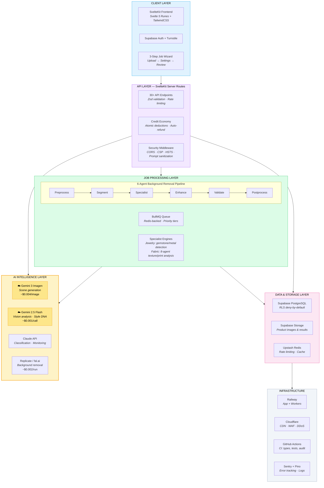

# SwiftList

AI-powered product image automation for the creator economy. Upload product photos, and SwiftList applies professional treatments — background removal, upscaling, lifestyle scene generation, and batch processing — in seconds.

**Status:** Pre-launch (Q1 2026)
**Domain:** [swiftlist.app](https://swiftlist.app)

---

## Tech Stack

| Layer | Technology |
|-------|-----------|
| **Frontend** | Svelte 5 (Runes), SvelteKit 2, TailwindCSS, TypeScript |
| **Backend** | SvelteKit server routes (+server.ts), Supabase (PostgreSQL + Auth + Storage) |
| **Job Processing** | BullMQ + Redis, Railway workers |
| **Image AI** | Replicate RMBG v1.4, fal.ai Bria RMBG 2.0, Google Gemini 3 (Imagen), Sharp |
| **LLM** | Claude (classification + monitoring), Gemini 2.5 Flash (vision analysis) |
| **Deployment** | Railway (app + workers), Cloudflare (CDN/WAF/DDoS) |
| **Payments** | Stripe |
| **Monitoring** | Sentry, Pino structured logging, Lifeguard (internal error monitoring) |
| **CI/CD** | GitHub Actions (type check, tests, dependency audit, secret scanning) |
| **Testing** | Vitest, Testing Library |

---

## Repository Structure

```
SwiftList/
├── apps/swiftlist-app-svelte/     # Production SvelteKit application
│   ├── src/
│   │   ├── routes/                # 19+ pages, 30+ API endpoints
│   │   │   ├── dashboard/         # User dashboard
│   │   │   ├── jobs/              # Job creation, processing, completion
│   │   │   ├── presets/           # Preset browsing, creation, favorites
│   │   │   ├── auth/              # Login, signup, password reset
│   │   │   ├── api/               # All server-side API routes
│   │   │   └── ...                # Pricing, profile, analytics, legal
│   │   ├── lib/
│   │   │   ├── agents/            # AI processing pipelines
│   │   │   │   ├── background-removal/  # 6-agent DAG pipeline
│   │   │   │   └── fabric-engine/       # 8-agent fabric analysis
│   │   │   ├── components/        # Svelte UI components
│   │   │   ├── security/          # Prompt sanitizer, PII scrubber, Turnstile
│   │   │   ├── validations/       # Zod schemas for all endpoints
│   │   │   └── utils/             # Logging, rate limiting, uploads
│   │   └── hooks.server.ts        # Auth middleware, CORS, security headers
│   └── package.json
├── workers/                       # BullMQ job workers (Railway)
│   ├── index.ts                   # Worker entry point
│   ├── Dockerfile                 # Railway container
│   └── workflows/                 # Workflow implementations
├── docs/                          # Architecture documentation
│   ├── TDD_MASTER_v4.0.md        # Technical Design Document (source of truth)
│   └── mission-control/           # Workflow dashboard specs
├── .github/workflows/ci.yml      # CI pipeline
└── .env.example                   # Environment variable template
```

---

## Architecture



### Google Cloud Integration

SwiftList uses two Google Cloud AI services as core infrastructure:

- **Gemini 3 (Imagen)** — Generates lifestyle scenes from product photos (flat lays, studio setups, in-context shots). See [`src/routes/api/jobs/process/+server.ts`](apps/swiftlist-app-svelte/src/routes/api/jobs/process/+server.ts)
- **Gemini 2.5 Flash** — Multimodal vision analysis for style transfer, fabric classification, and image quality scoring. See [`src/routes/api/ai/analyze-reference/+server.ts`](apps/swiftlist-app-svelte/src/routes/api/ai/analyze-reference/+server.ts)

### Background Removal Pipeline

LangGraph-inspired 6-agent DAG with product-type routing:

- **Preprocess** — Format detection, HEIC conversion, metadata extraction
- **Segment** — Background removal via Replicate RMBG or fal.ai Bria
- **Specialist** — Jewelry engine (gemstone/metal detection) or fabric engine (texture/print preservation)
- **Enhance** — Edge refinement (CleanEdge), color correction, shadow generation
- **Validate** — Multi-metric quality scoring (edge, segmentation, artifacts)
- **Postprocess** — Format conversion, watermarking, ZIP packaging

Quality threshold: 85%. Conditional retry on failure. Product types: jewelry, apparel, general.

---

## Key Features

- **Authentication** — Supabase Auth with Turnstile bot protection, password reset, user enumeration prevention
- **Job System** — 3-step wizard (Upload > Settings > Review), real-time processing status, batch downloads
- **Credit Economy** — Server-side cost calculations, atomic deductions, auto-refund on failure
- **Preset Marketplace** — User-created processing presets with favorites and usage tracking
- **AI Agents** — 6-agent background removal, 8-agent fabric analysis, scene generation, image classification
- **Mobile-First** — Responsive across 375px, 768px, 1024px+ breakpoints

---

## Security

- **Row Level Security** — Deny-by-default on all Supabase tables, `auth.uid()` enforcement
- **Server-Side Only** — All business logic, cost calculations, and API keys in +server.ts routes
- **Input Validation** — Zod schemas on every API endpoint
- **Rate Limiting** — Multi-tier via Upstash (IP-based anonymous, user-based authenticated)
- **Prompt Sanitization** — All 12 LLM integration points protected against injection
- **Webhook Security** — Stripe HMAC signature verification with idempotency
- **Security Headers** — HSTS, CSP, X-Frame-Options, X-Content-Type-Options
- **Secret Scanning** — Gitleaks in CI, pre-commit hook on local dev
- **Error Handling** — Safe error messages (no stack traces), Sentry tracking

See the Security section above for an overview of our security practices.

---

## Development

### Prerequisites

- Node.js 20+, npm
- Supabase project credentials
- API keys: Anthropic, Google Cloud (Gemini), Replicate, fal.ai, Stripe

### Setup

```bash
cd apps/swiftlist-app-svelte
npm install
npm run dev
```

### Scripts

```bash
npm run dev          # Start dev server
npm run build        # Production build
npm test             # Run test suite
npm run test:watch   # Watch mode
npm run test:coverage # Coverage report
```

### CI Pipeline

GitHub Actions runs on every push and PR to `main`:

1. **TypeScript & Lint** — `svelte-check` type checking
2. **Tests** — Vitest test suite
3. **Dependency Audit** — `npm audit` for high/critical vulnerabilities
4. **Secret Scanning** — Gitleaks full-history scan

---

## Documentation

| Document | Purpose |
|----------|---------|
| [TDD v4.1](docs/TDD_MASTER_v4.0.md) | Master architecture bible — all technical decisions |
| [CONTRIBUTING.md](CONTRIBUTING.md) | Development standards and security checklist |
| [workers/ARCHITECTURE.md](workers/ARCHITECTURE.md) | Worker infrastructure and deployment |

---

## Business Model

| Tier | Price | Credits/month |
|------|-------|---------------|
| Explorer | Free | 100 |
| Maker | $29/mo | 500 |
| Merchant | $99/mo | 2,000 |

1 credit = $0.05 USD. Background removal costs 5 credits. Average margin: 93.2%.

---

**Last Updated:** March 3, 2026
**Built with Claude Code using security-first patterns**
