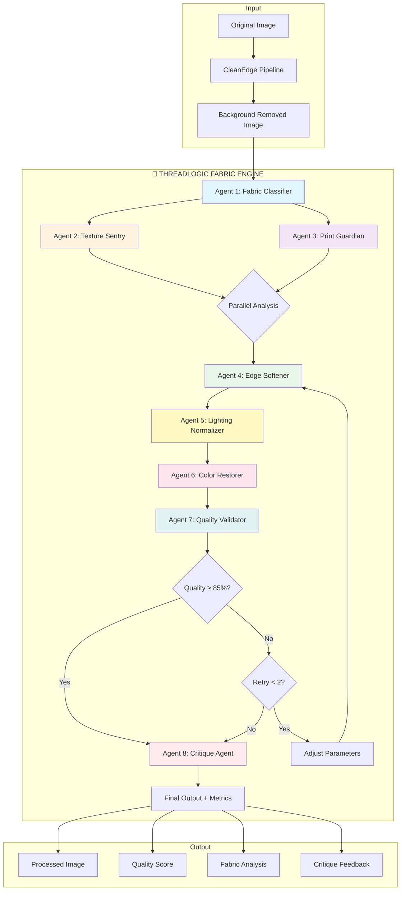

# ThreadLogic Fabric Engine Architecture

## Overview

ThreadLogic is an 8-agent multi-agent pipeline designed for processing fashion and textile product images. It takes the output from CleanEdge (background removal) and applies fabric-specific enhancements while preserving texture, prints, and color fidelity.

**Competitive Positioning:**
- **Photoroom "Product Beautifier"** → We match their lighting normalization while preserving true colors
- **Claid.ai "Product Preservation"** → We match (or exceed) their logo/print fidelity with zero-tolerance distortion

## System Diagram



## Agent Descriptions

### Agent 1: Fabric Classifier
**File:** `agents/fabric-classifier.ts`
**API:** Gemini 2.5 Flash Vision (~$0.001/call)

Classifies the input image:
- Fabric category (opaque_woven, knit, leather, metallic)
- Photography type (flatlay, mannequin, on_model, hanging)
- Specific fabric type (denim, cashmere, silk, etc.)
- Drape factor, texture complexity, reflectivity
- Print type and coverage

### Agent 2: Texture Sentry
**File:** `agents/texture-sentry.ts`
**API:** None (local processing)

**CRITICAL FUNCTION:** Prevents AI over-smoothing of fabric textures.

Techniques:
- Local Binary Pattern (LBP) variance analysis
- Gabor filter response for weave/knit detection
- Fold detection via gradient analysis
- Risk region identification for smoothing protection

### Agent 3: Print Guardian
**File:** `agents/print-guardian.ts`
**API:** None (local processing)

**CRITICAL FUNCTION:** Zero-tolerance protection for logos, prints, patterns.

Techniques:
- Local contrast analysis for print detection
- Color clustering to identify print regions
- Edge density mapping via Sobel operator
- Connected component analysis for region bounds
- Pixel-perfect protection mask creation

### Agent 4: Edge Softener
**File:** `agents/edge-softener.ts`
**API:** None (local processing)

Applies fabric-appropriate edge softening:
- Adaptive feathering based on fabric type
- Knits → more feathering (fuzzy edges)
- Leather → minimal feathering (clean edges)
- Seam/hem preservation zones (no softening)

### Agent 5: Lighting Normalizer
**File:** `agents/lighting-normalizer.ts`
**API:** None (local processing)

Mimics Photoroom "Product Beautifier":
- White balance estimation
- Shadow lifting (reveal detail)
- Highlight recovery (compress blown-out areas)
- Color anchor system to prevent drift

### Agent 6: Color Restorer
**File:** `orchestrator.ts` (inline agent)
**API:** None (local processing)

Restores original pixels in protected print regions after all processing. Ensures prints/logos are pixel-perfect.

### Agent 7: Quality Validator
**File:** `orchestrator.ts` (inline agent)
**API:** None (local processing)

Quick quality check to determine if retry is needed.

### Agent 8: Critique Agent
**File:** `agents/critique-agent.ts`
**API:** None (local processing)

**Chain-of-Verification** against CleanEdge standards:
- Edge consistency check
- Texture preservation verification
- Print integrity validation
- Color fidelity measurement (Delta E)
- Drape/fold preservation check

## Quality Scoring

### Weights
| Metric | Weight | Rationale |
|--------|--------|-----------|
| Print Integrity | 30% | Highest priority - logo/print distortion is unacceptable |
| Texture Preservation | 25% | Fabric texture must be maintained |
| Color Fidelity | 20% | True colors critical for e-commerce |
| Edge Consistency | 15% | Must match CleanEdge quality |
| Drape Realism | 10% | Folds should look natural |

### Thresholds
- **Auto-approve:** ≥85% overall quality
- **Max retries:** 2 attempts
- **Critical issues:** Any score <50% in a category triggers retry

## Cost Analysis

| Component | Cost per Image | Notes |
|-----------|----------------|-------|
| Gemini 2.5 Flash (classification) | $0.001 | Single API call |
| Local processing (7 agents) | $0.000 | Runs on server |
| **Total ThreadLogic** | **~$0.001** | Extremely cost-efficient |

## Integration with CleanEdge

```typescript
import { processWithThreadLogic } from '$lib/agents/fabric-engine';

// In the main background removal orchestrator:
if (productType === 'clothing') {
  // Route to ThreadLogic after CleanEdge
  const threadLogicResult = await processWithThreadLogic(
    cleanEdgeOutput,
    originalImage,
    jobId,
    userId,
    { qualityThreshold: 0.85 }
  );

  return threadLogicResult.buffer;
}
```

## V1.0 Fabric Support

| Category | Examples | Status |
|----------|----------|--------|
| Opaque Woven | Denim, cotton twill, canvas | ✅ Supported |
| Knits | Sweaters, jersey, ribbed | ✅ Supported |
| Leather | Leather, faux leather, suede | ✅ Supported |
| Metallic | Sequins, metallic thread, lamé | ✅ Supported |
| Sheer/Translucent | Chiffon, organza, lace | ❌ Post-MVP |
| Velvet/Plush | Velour, crushed velvet | ❌ Post-MVP |

## Future Enhancements

1. **Sheer fabric handling** - Transparency-aware processing
2. **Velvet/plush support** - Directional nap detection
3. **3D mannequin mode** - Ghost mannequin processing
4. **On-model mode** - Human model detection and handling
5. **Training data collection** - For future proprietary model

## File Structure

```
fabric-engine/
├── index.ts                    # Main exports
├── orchestrator.ts             # 8-agent DAG executor
├── types.ts                    # TypeScript types
├── ARCHITECTURE.md             # This document
└── agents/
    ├── fabric-classifier.ts    # Agent 1: Gemini Vision classification
    ├── texture-sentry.ts       # Agent 2: Anti-smoothing analysis
    ├── print-guardian.ts       # Agent 3: Logo/print protection
    ├── edge-softener.ts        # Agent 4: Fabric-aware edges
    ├── lighting-normalizer.ts  # Agent 5: Photoroom-style lighting
    └── critique-agent.ts       # Agent 8: Chain-of-Verification
```

## Performance Targets

| Metric | Target | Notes |
|--------|--------|-------|
| Total latency | <3 seconds | For flatlay photography |
| Quality score | >85% | Auto-approval threshold |
| Print fidelity | >95% | Zero-tolerance on logos |
| Color accuracy | ΔE <10 | Imperceptible difference |
| Texture preservation | >80% | Maintain fabric detail |

---

**Version:** 1.0.0
**Author:** SwiftList Team
**Last Updated:** February 2026
