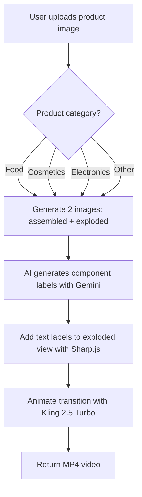

# WF-39: Product Exploded View with Animated Labels

**Status**: Future Workflow (Phase 5+)
**Date**: January 5, 2026
**Based On**: Chick-fil-A viral ad technique

---

## Overview

**What it does**: Takes a product image (food, cosmetics, electronics, etc.) → generates exploded view animation with floating components + animated text labels describing each layer/feature.

**Viral Example**: Chick-fil-A Spicy Deluxe sandwich explodes to show:
- Top bun ("Soft, lightly toasted finish")
- Cheese ("Creamy, savory finish")
- Chicken ("Crispy, seasoned protein")
- Pickles ("Signature tang & acidity")
- Tomato ("Juicy brightness")
- Lettuce ("Fresh crunch & balance")
- Bottom bun ("Soft, lightly toasted foundation")

**Marketing Impact**: This technique went viral because it:
- Shows product quality (transparency)
- Educates viewers on ingredients/components
- Creates "satisfying" visual effect (ASMR-like)
- Works for ads, social media, product pages

---

## Technical Breakdown (From Tweet)

**Creator's Process**:
1. **Generate 2 images** with Nano Banana Pro:
   - Image 1: Product in normal state (sandwich assembled)
   - Image 2: Product in exploded state (components floating apart)
2. **Animate transition** with Kling 2.5 Turbo:
   - Smooth morph from Image 1 → Image 2
   - Components separate with natural physics
   - Text labels appear and expand alongside components

**Duration**: ~5-8 seconds
**Result**: "Juicy end-screen for any ad"

---

## SwiftList Implementation: 3-Step Process

### Step 1: Generate Exploded View Images

**Tool**: Nano Banana Pro (Replicate) OR Flux.1 Pro OR Stable Diffusion XL

**Input**: Product image (assembled state)

**Prompt Engineering**:

```javascript
// Step 1A: Generate assembled product (clean studio shot)
const assembledPrompt = `
Professional product photography of ${productName},
assembled, centered, white background, studio lighting,
4K quality, photorealistic
`;

// Step 1B: Generate exploded view
const explodedPrompt = `
Exploded view diagram of ${productName},
all components floating separately with even spacing,
arranged vertically in order, white background,
studio lighting, technical illustration style,
components labeled with arrows pointing to each part,
4K quality, photorealistic
`;
```

**Example for Food (Burger/Sandwich)**:
```
Prompt: "Exploded view of Chick-fil-A spicy chicken sandwich,
top bun floating above, cheese, breaded chicken fillet,
pickles, tomato slices, lettuce, bottom bun,
all components separated vertically with 2-inch spacing,
white background, studio lighting, professional food photography"
```

**Example for Cosmetics (Lipstick)**:
```
Prompt: "Exploded view of luxury lipstick,
cap floating above, lipstick tube,
bullet/lipstick tip separated,
inner mechanism visible,
white background, studio lighting"
```

**Example for Electronics (Smartwatch)**:
```
Prompt: "Exploded view of smartwatch,
screen floating above, watch body,
internal components (battery, circuit board),
watch band separated,
white background, technical diagram style"
```

**API Call**:
```typescript
// Using Replicate (Nano Banana Pro)
const assembledImage = await replicate.run(
  "fofr/nano-banana-pro:...",
  {
    input: {
      prompt: assembledPrompt,
      num_outputs: 1,
      aspect_ratio: "1:1",
      output_format: "png"
    }
  }
);

const explodedImage = await replicate.run(
  "fofr/nano-banana-pro:...",
  {
    input: {
      prompt: explodedPrompt,
      num_outputs: 1,
      aspect_ratio: "1:1",
      output_format: "png"
    }
  }
);
```

**Output**:
- `assembled.png` (1024×1024)
- `exploded.png` (1024×1024)

---

### Step 2: Add Text Labels to Exploded View

**Tool**: Image manipulation (Sharp.js) + AI text generation (Gemini 3 Flash)

**Process**:

1. **AI identifies components** from product description
2. **Generate marketing copy** for each component
3. **Position text labels** with arrows/lines pointing to components

**AI Prompt for Label Generation**:

```javascript
const labelPrompt = `
You are a product marketing copywriter.
Generate short, appetizing descriptions for each component of this ${productCategory} product.

Product: ${productName}
Components: ${componentsList}

For each component, write:
- 2-4 words maximum
- Focus on sensory qualities (taste, texture, feel, appearance)
- Use adjectives that sell

Format as JSON:
{
  "top_bun": "Soft, lightly toasted finish",
  "cheese": "Creamy, savory finish",
  "chicken": "Crispy, seasoned protein",
  ...
}
`;

// Call Gemini 3 Flash
const labels = await gemini.generateContent(labelPrompt);
```

**Text Overlay with Sharp.js**:

```javascript
const sharp = require('sharp');
const { createCanvas } = require('canvas');

async function addLabelsToExplodedView(explodedImagePath, labels) {
  const canvas = createCanvas(1024, 1024);
  const ctx = canvas.getContext('2d');

  // Load exploded view image
  const baseImage = await sharp(explodedImagePath).toBuffer();

  // Set up text styling
  ctx.font = 'bold 24px Arial';
  ctx.fillStyle = '#333333';
  ctx.textAlign = 'left';

  // Position labels (adjust Y coordinates based on component positions)
  const labelPositions = {
    'top_bun': { x: 100, y: 150 },
    'cheese': { x: 900, y: 220 },
    'chicken': { x: 100, y: 290 },
    'pickles': { x: 900, y: 380 },
    'tomato': { x: 100, y: 460 },
    'lettuce': { x: 900, y: 560 },
    'bottom_bun': { x: 100, y: 650 }
  };

  // Draw each label with connecting line
  Object.entries(labels).forEach(([component, text]) => {
    const pos = labelPositions[component];

    // Draw line from component to label
    ctx.beginPath();
    ctx.moveTo(pos.x + 200, pos.y); // End of line (near component)
    ctx.lineTo(pos.x, pos.y);       // Start of line (at text)
    ctx.strokeStyle = '#999999';
    ctx.lineWidth = 2;
    ctx.stroke();

    // Draw text
    ctx.fillText(text, pos.x - 180, pos.y + 5);
  });

  // Composite labeled image
  const labeledImage = await sharp(baseImage)
    .composite([{ input: canvas.toBuffer(), blend: 'over' }])
    .png()
    .toBuffer();

  return labeledImage;
}
```

**Output**:
- `exploded_labeled.png` (1024×1024 with text labels)

---

### Step 3: Animate Transition with Kling 2.5 Turbo

**Tool**: Kling AI 2.5 Turbo (video generation)

**Input**:
- Start frame: `assembled.png`
- End frame: `exploded_labeled.png`

**Animation Process**:

```typescript
// Using Kling AI API
const videoResult = await fetch('https://api.klingai.com/v1/videos/image-to-video', {
  method: 'POST',
  headers: {
    'Authorization': `Bearer ${process.env.KLING_API_KEY}`,
    'Content-Type': 'application/json'
  },
  body: JSON.stringify({
    model: "kling-2.5-turbo",
    image_url: assembledImageUrl,      // Start frame
    end_image_url: explodedImageUrl,   // End frame (with labels)
    duration: 6,                        // 6 seconds
    mode: "professional",
    prompt: "Smooth explosion animation where product components float apart vertically, text labels fade in and expand alongside components, studio lighting maintained throughout, professional product video",
    aspect_ratio: "16:9",
    fps: 30
  })
});

const videoUrl = videoResult.task_id;
// Poll for completion, then download MP4
```

**Kling AI Parameters**:
- **Mode**: "professional" (higher quality, slower generation)
- **Duration**: 5-8 seconds (6 seconds optimal)
- **FPS**: 30 (smooth motion)
- **Physics**: Natural gravity simulation for floating components
- **Text animation**: Labels fade in + scale up (0.8x → 1.0x)

**Output**:
- `exploded_animation.mp4` (1920×1080, 6 seconds, 30fps)

---

## Complete Workflow Specification

### WF-39: Product Exploded View Animation

**Function**: Generate exploded view animation with labeled components

**Input**:
- Product image (or product name for AI generation)
- Product category (food, cosmetics, electronics, furniture, etc.)
- Component list (optional - AI can infer)

**Process**:



**Models Used**:
1. **Nano Banana Pro** (Replicate) - Generate assembled + exploded images
   - Cost: $0.025 per image × 2 = $0.05
2. **Gemini 3 Flash** - Generate marketing copy for labels
   - Cost: $0.001
3. **Kling AI 2.5 Turbo** - Animate transition
   - Cost: $0.60 per video (6 seconds)

**Total Cost**: $0.651 per video

**Credits**: 100 credits ($5.00 revenue)

**Margin**: 87%

**Duration**: 6-8 seconds (user selectable)

**Output Format**: MP4 (1920×1080, 30fps)

---

## Specialty Logic Variations

### Food Products (Burgers, Sandwiches, Layered Desserts)
**Component Detection**: Bun, patty, toppings, condiments, etc.
**Label Style**: Sensory descriptors (juicy, crispy, fresh, tangy)
**Animation Speed**: Medium (6 seconds) - appetizing pace
**Spacing**: 2-3 inches between layers

**Example Labels**:
- Burger: "Flame-grilled beef", "Melted aged cheddar", "Crisp iceberg lettuce"
- Cake: "Fluffy vanilla sponge", "Silky chocolate ganache", "Whipped cream frosting"

### Cosmetics (Lipstick, Foundation, Skincare)
**Component Detection**: Cap, tube, applicator, formula, packaging
**Label Style**: Luxury descriptors (smooth, rich, premium, long-lasting)
**Animation Speed**: Slow (8 seconds) - elegant, luxurious feel
**Spacing**: 1-2 inches between components

**Example Labels**:
- Lipstick: "Magnetic gold cap", "Hydrating vitamin E formula", "Precision applicator"
- Serum: "Airless pump technology", "24K gold-infused serum", "UV-protective glass bottle"

### Electronics (Smartphones, Smartwatches, Earbuds)
**Component Detection**: Screen, body, battery, circuit board, sensors
**Label Style**: Technical specs (battery capacity, processor, display resolution)
**Animation Speed**: Medium-fast (5 seconds) - tech-savvy pace
**Spacing**: 1-2 inches, organized grid layout

**Example Labels**:
- Smartwatch: "AMOLED Retina display", "48-hour battery", "Health sensors suite"
- Earbuds: "Active noise cancellation", "6mm titanium drivers", "Wireless charging case"

### Jewelry (Rings, Necklaces, Watches)
**Component Detection**: Gemstone, setting, band, clasp
**Label Style**: Luxury materials (14K gold, natural diamond, rhodium-plated)
**Animation Speed**: Very slow (10 seconds) - showcase luxury
**Spacing**: 2-3 inches, dramatic spacing

**Example Labels**:
- Ring: "1.5ct natural diamond", "Platinum prong setting", "18K white gold band"
- Watch: "Swiss automatic movement", "Sapphire crystal face", "Italian leather strap"

### Furniture (Chairs, Tables, Cabinets)
**Component Detection**: Frame, cushions, legs, hardware
**Label Style**: Craftsmanship focus (handcrafted, solid wood, premium upholstery)
**Animation Speed**: Medium (7 seconds)
**Spacing**: 3-4 inches (larger components)

**Example Labels**:
- Chair: "Solid oak frame", "Memory foam cushioning", "Belgian linen upholstery"
- Cabinet: "Dovetail joints", "Soft-close hinges", "Reclaimed barnwood finish"

---

## User Interface Design

### Input Form:

```
┌─────────────────────────────────────────────────┐
│  WF-39: Product Exploded View Animation         │
├─────────────────────────────────────────────────┤
│                                                  │
│  📸 Upload Product Image                         │
│  [  Drag & drop or click to upload  ]           │
│                                                  │
│  📦 Product Category                             │
│  ( ) Food & Beverage                            │
│  ( ) Cosmetics & Beauty                         │
│  ( ) Electronics & Tech                         │
│  ( ) Jewelry & Accessories                      │
│  ( ) Furniture & Home                           │
│  ( ) Other                                      │
│                                                  │
│  🏷️ Component Labels (Optional)                 │
│  Let AI generate labels automatically, or       │
│  enter custom labels for each component:        │
│                                                  │
│  [ Add Custom Labels ]                          │
│                                                  │
│  ⏱️ Animation Duration                           │
│  [====|====] 6 seconds                          │
│  (5-10 seconds)                                 │
│                                                  │
│  💰 Cost: 100 credits                            │
│                                                  │
│  [ Generate Exploded View Animation ]           │
│                                                  │
└─────────────────────────────────────────────────┘
```

---

## Example Prompts by Category

### Food: Pizza
**Assembled**: "Professional food photography of pepperoni pizza, whole, centered, white background, studio lighting"

**Exploded**: "Exploded view of pepperoni pizza, layers floating: top crust, melted mozzarella, pepperoni slices, tomato sauce, dough base, all separated vertically, white background, studio lighting"

**Labels**:
- "Golden, crispy crust"
- "Melted mozzarella blend"
- "Premium pepperoni"
- "San Marzano tomato sauce"
- "Hand-tossed dough"

### Cosmetics: Perfume Bottle
**Assembled**: "Luxury perfume bottle, centered, white background, studio lighting, product photography"

**Exploded**: "Exploded view of perfume bottle, cap floating above, spray nozzle, glass bottle, fragrance liquid visible inside, box packaging below, white background"

**Labels**:
- "18K gold-plated cap"
- "Precision spray atomizer"
- "Crystal glass vessel"
- "Eau de parfum 50ml"
- "Signature gift box"

### Electronics: Wireless Earbuds
**Assembled**: "Wireless earbuds in charging case, centered, white background, product photography"

**Exploded**: "Exploded view of wireless earbuds, left earbud floating, right earbud, charging case lid, case base, internal battery visible, white background"

**Labels**:
- "Active noise cancellation"
- "6mm dynamic drivers"
- "Silicone ear tips (3 sizes)"
- "USB-C charging case"
- "20-hour battery life"

---

## API Integration Requirements

### 1. Replicate (Nano Banana Pro)
```bash
# Environment variable
REPLICATE_API_KEY=r8_...

# Pricing
$0.025 per image generation
```

### 2. Kling AI 2.5 Turbo
```bash
# Environment variable
KLING_API_KEY=kling_...

# Pricing
$0.60 per video (6 seconds)
$0.10 per additional second
```

### 3. Gemini 3 Flash (Label Generation)
```bash
# Already integrated
# Cost: $0.001 per request
```

### 4. Sharp.js (Text Overlay)
```bash
# Already available (local processing)
# Cost: $0
```

---

## Database Schema Updates

```sql
-- Add to jobs table
ALTER TABLE jobs
ADD COLUMN exploded_view_metadata JSONB; -- Store component labels, positions, etc.

-- Example metadata structure
{
  "components": [
    {
      "name": "top_bun",
      "label": "Soft, lightly toasted finish",
      "position_y": 150
    },
    {
      "name": "cheese",
      "label": "Creamy, savory finish",
      "position_y": 220
    }
  ],
  "animation_duration": 6,
  "product_category": "food"
}
```

---

## Success Metrics

### Quality Metrics
- Component separation clarity: Target >95% (all components visibly distinct)
- Text readability: Target >90% (labels clearly legible at 1080p)
- Animation smoothness: Target >4.5/5.0 user rating

### Business Metrics
- Adoption rate: Target >5% of users (viral potential)
- Social shares: Target >15% of users share output
- Re-generation rate: Target <10% (high satisfaction)

### Technical Metrics
- Generation time: Target <90 seconds (2 images + labels + video)
- API success rate: Target >92% (Kling AI can be flaky)
- Label accuracy: Target >85% (AI correctly identifies components)

---

## Marketing Positioning

**Tagline**: "Show what's inside. Make it viral."

**Use Cases**:
1. **Social Media Ads** - Facebook, Instagram, TikTok (highest engagement format)
2. **Product Launch Videos** - "What makes our product special"
3. **Educational Content** - "How it's made" / "What's inside" series
4. **E-commerce Product Pages** - Hero video showing quality/transparency
5. **Comparison Videos** - "Our ingredients vs competitors"

**Target Customers**:
- Food brands (restaurants, packaged goods)
- Cosmetics brands (luxury beauty, skincare)
- Electronics brands (tech products, gadgets)
- Jewelry brands (engagement rings, luxury watches)

---

## Risks & Mitigations

### Risk 1: AI Incorrectly Identifies Components
**Mitigation**:
- Allow user to provide custom component list
- Show preview before video generation
- Offer "Re-generate labels" button (free)

### Risk 2: Kling AI Quality Inconsistent
**Mitigation**:
- Implement quality scoring pre-delivery
- Auto-reject videos with low quality score
- Fallback to Runway Gen-3 if Kling fails

### Risk 3: Text Labels Overlap Components
**Mitigation**:
- AI-powered label positioning (avoid overlaps)
- Left/right alternating pattern
- User can adjust label positions in preview

---

## Competitive Advantage

**What competitors offer**:
- ❌ Pebblely: Static images only
- ❌ Flair.ai: No exploded view capability
- ❌ ProductScope: Basic 360° spin only

**SwiftList with WF-39**:
- ✅ First AI tool offering exploded view animations
- ✅ Automated label generation (no manual text overlay)
- ✅ Category-specific optimizations (food vs cosmetics vs electronics)
- ✅ Viral-ready format (proven by Chick-fil-A example)

---

## Implementation Timeline

### Week 1: Prototype
- Integrate Nano Banana Pro API
- Test exploded view prompt engineering
- Prototype text overlay with Sharp.js

### Week 2: Label Generation
- Integrate Gemini for label text
- Build component detection logic
- Test label positioning algorithm

### Week 3: Animation
- Integrate Kling AI 2.5 Turbo API
- Test assembled → exploded transitions
- Optimize animation parameters

### Week 4: Polish & Launch
- Build user interface
- Add category-specific templates
- Launch as premium feature (100 credits)

---

## Next Steps

1. **User Approval**: Get feedback on WF-39 concept
2. **API Access**: Sign up for Kling AI, Replicate accounts
3. **Prototype**: Build proof-of-concept with Chick-fil-A sandwich
4. **Cost Validation**: Confirm Kling AI pricing (may fluctuate)
5. **Add to Roadmap**: Include in FUTURE-WORKFLOWS-AI-VIDEO-TRENDS.md

---

**Last Updated**: January 5, 2026
**Status**: Specification complete - ready for prototyping
**Expected Launch**: Month 4-5 (post-MVP)
